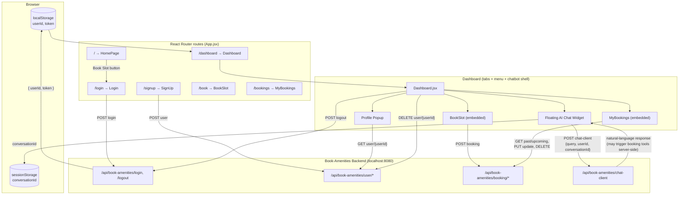

# Book-Amenities-UI

A React 19 + Vite frontend for the [Book-Amenities](https://github.com/Rezon669/Book-Amenities) Spring Boot backend — lets residents of a gated community sign up, log in, browse amenities, book/edit/cancel slots, and chat with an AI assistant that can act on bookings via natural language.

Styled with Tailwind CSS v4 and shadcn/ui-style components.

---

## ✨ Features

- **Auth flow** — Sign up, log in (JWT stored client-side), and log out (calls the backend logout endpoint to blacklist the token, then clears local state regardless of server response).
- **Amenity showcase landing page** — visual grid of amenities (pool, badminton, basketball, table tennis, convention hall) with a "Book Slot" CTA that routes into the login flow.
- **Slot booking** — amenity dropdown, date picker (past dates disabled), and 30-minute start/end time slot selectors; posts directly to the backend's validated booking endpoint.
- **My Bookings** — tabbed view of past vs. upcoming bookings, with **inline edit** (pre-filled form, date format converted between UI `yyyy-mm-dd` and backend `dd-mm-yyyy`) and **delete with confirmation**.
- **Floating AI chatbot widget** — persistent chat bubble on the dashboard; sends messages with a per-browser-session `conversationId` (generated via `crypto.randomUUID()`, stored in `sessionStorage`) so the backend can maintain multi-turn context and route to booking tools or RAG-based FAQ answers.
- **Profile popup** — fetches and displays the logged-in user's details (name, flat, block, mobile) in a modal.
- **Account deletion** — self-service account removal from the dashboard menu, with a confirm dialog.

---

## 🏗️ Architecture



**Auth & session flow**

1. `Login.jsx` posts credentials to `/login`; on success, `userId` and `token` are stored in `localStorage` (no HttpOnly cookie — see Known Limitations).
2. Every subsequent authenticated request reads the token from `localStorage` and sends it as `Authorization: Bearer <token>`.
3. `Dashboard.jsx`'s logout handler calls the backend `/logout` (which blacklists the token server-side) and then clears `localStorage`/`sessionStorage` regardless of whether the network call succeeds, so the user is always logged out client-side.

**Chatbot flow**

1. On first message, the widget generates a `conversationId` via `crypto.randomUUID()` and persists it in `sessionStorage` so the same conversation thread continues across messages (cleared on logout).
2. Each message is POSTed to `/api/book-amenities/chat-client` along with `userId` and `conversationId`; the backend may resolve the query itself (FAQ/RAG) or invoke booking tools (create/cancel/list) — the UI just renders whatever `response` text comes back.

**Booking edit flow (date format handling)**

- The backend expects/returns dates as `dd-MM-yyyy`, while the HTML `<input type="date">` requires `yyyy-MM-dd`. `MyBookings.jsx` converts between the two directions (`.split("-").reverse().join("-")`) when populating and submitting the edit form — worth knowing if you extend this component, since it's a manual conversion rather than a date library.

---

## 🧰 Tech Stack

| Layer | Technology |
|---|---|
| Framework | React 19, React Router 7 |
| Build tool | Vite 7 |
| Styling | Tailwind CSS v4, `tailwindcss-animate`, `tw-animate-css` |
| UI components | shadcn/ui-style primitives (`Button`, `Card`) built on Radix Slot + `class-variance-authority` |
| Icons | lucide-react |
| Utilities | `clsx` + `tailwind-merge` (via a shared `cn()` helper) |
| Linting | ESLint 9 (flat config) with React Hooks / React Refresh plugins |
| Backend (separate repo) | [Book-Amenities](https://github.com/Rezon669/Book-Amenities) — Spring Boot + Spring AI |

---

## 🗂️ Project Structure

```
src/
├── App.jsx                  # Route definitions
├── main.jsx                 # React root + StrictMode
├── index.css / App.css      # Global styles, Tailwind entry
├── components/
│   ├── HomePage.jsx          # Landing page with amenity showcase
│   ├── Login.jsx              # Login form
│   ├── SignUp.jsx              # Registration form
│   ├── Dashboard.jsx           # Tabs (Book / My Bookings), menu, profile popup, AI chat widget
│   ├── BookSlot.jsx             # New booking form
│   ├── MyBookings.jsx            # Past/upcoming bookings, edit + delete
│   ├── Header.jsx                 # Shared page header
│   └── ui/
│       ├── button.jsx              # shadcn-style Button (cva variants)
│       └── card.jsx                 # shadcn-style Card primitives
├── lib/utils.js               # cn() class-merging helper
└── assets/                    # Static assets (react.svg)
public/images/                 # Amenity photos used on the landing page
```

---

## ⚙️ Getting Started

### Prerequisites
- Node.js 18+ and npm
- The [Book-Amenities](https://github.com/Rezon669/Book-Amenities) backend running locally on `http://localhost:8080` (this UI has no mock/offline mode — every screen depends on the live API)

### Install & run
```bash
npm install
npm run dev
```
The app runs on Vite's default dev port (`http://localhost:5173` — this is also the origin the backend's CORS config currently allows).

### Other scripts
```bash
npm run build     # Production build
npm run preview   # Preview the production build locally
npm run lint      # Run ESLint
```

---

## 📄 License

MIT — feel free to use this as a reference implementation for a React + Spring AI chatbot-integrated booking UI.
